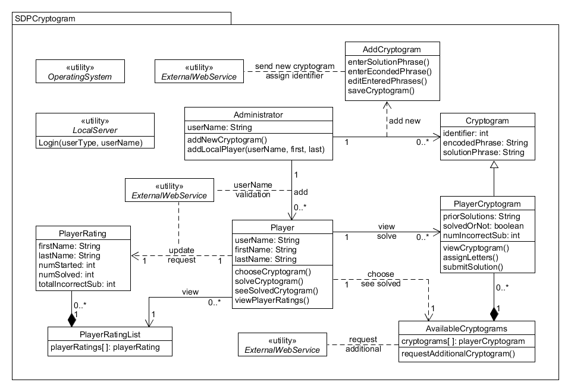
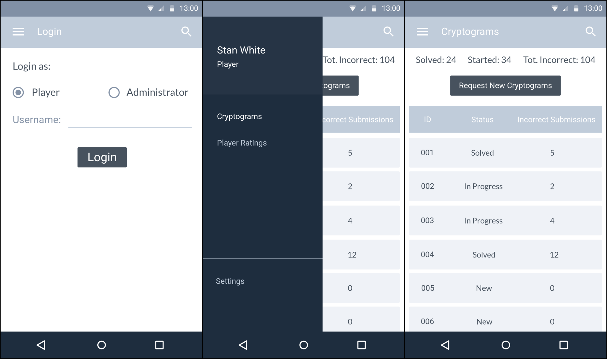
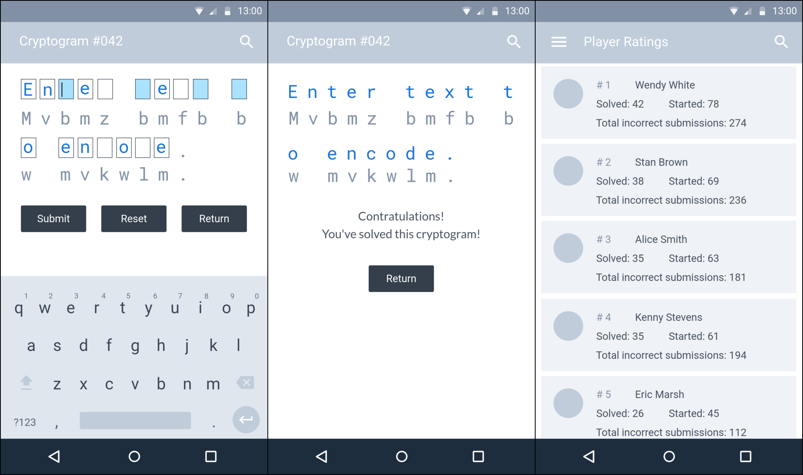
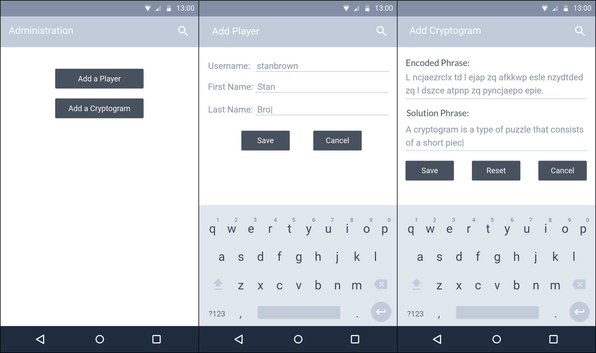

# Design Document

**Author**: Team 19

**Version**: 1.1

| Version | Time | Description |
| --------| -----| ------------|
| 1.1 | 07/07/2017 | class diagram modified |
| 1.0 | 06/30/2017 | full doc submitted in D2 |

## 1 Design Considerations

### 1.1 Assumptions

- A **central server** will be available for 24 hours 7 days.
- Android phones satisfying the minimum operating system requirement **(Android 4.4)** will be available to run the application.
- Suitable **external libraries** can be used for communication between phones and the central server.
- **Internet access** will be available when specific features require data exchange between phones and the central server.
- The users will have to grant **storage permission** to the system before they can use it.
- **User authentication** will **not** be available. Only the unique user names will be used for login. Game progress will be fetched according to the logged user name.
- No loss will be compensated due to **disclosure of user names** to third parties.
- There will be **only one administrator**. Only normal players can be created. No other users with administration privileges can be created.
- The administrator **must not** include any **explicit content** in neither user names nor cryptograms (encoded phrases or solution phrases), as **No filtering feature** will be available.
- Parent control feature will not be available. The application will not prevent non-adults from using it in inappropriate time.
- **Temporary game process lost** due to forced crash will **not** be recovered.

### 1.2 Constraints

- The system will be developed using **Java programming language**, **standard Android API**, and **free open source libraries**.
- The system must run on an Android phone with **Android 4.4 and higher** version OS installed.
- The system UI language will be shown in **English only**. The cryptograms will only have English phrases.
- As limited budget, the system will only be tested on **Android Virtual Devices** (AVDs) created in Android Studio.
- As limited time, the functionality of **filtering explicit content** in cryptograms will **not** be available.

### 1.3 System Environment

- **Operating System**: Android 4.4 and higher (Android Watch and Android TV are not supported)
- **CPU**: 1.2 GHz and higher
- **RAM**: 1.0 GB and larger
- **Internet access** through cellular or WLAN is available when necessary.

## 2 Architectural Design

### 2.1 Component Diagram

### 2.2 Deployment Diagram

## 3 Low-Level Design

### 3.1 Class Diagram

### 3.2 Other Diagrams

## 4 User Interface Design

- Left: A user can select to log in as a player or the administrater. Then login with a username.
- Right: A list of cryptograms will be shown when a player logs in successfully.
- Central: A player can click the sidebar menu button to choose either "Cryptograms" or "Player Ratings".

- Left: It shows the UI when a player is solving a cryptogram. A player can assign replacement characters on the blanks above the encrypted characters.
- Central: Once a cryptogram is sovled correctly by a player, the palyer can only view it, and cannot take any other activities.
- Right: A list of player ratings sorted by the number of cryptograms solved.

- Left: Administration menu, from which the administrator can choose to add a new player and add a new cryptogram.
- Center: UI for adding a new player.
- Right: UI for adding a new cryptogram.

